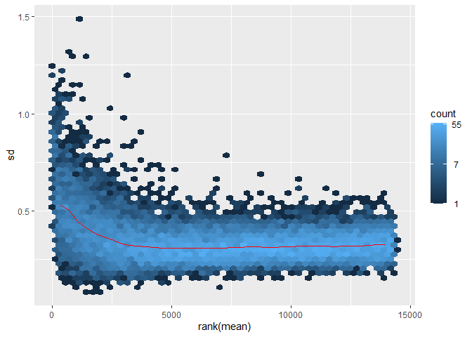

RNAseq Pipeline Report
================
Michal Varga
2024-10-30

# Introduction

# Preprocessing

do this last

# Differential Expression Analysis

## Load Required Libraries

Install scientific packages via `BiocManager`.

``` r
if (!require("BiocManager", quietly = TRUE))
    install.packages("BiocManager")

BiocManager::install("DESeq2")
BiocManager::install("org.Bt.eg.db")
BiocManager::install("biomaRt")
BiocManager::install("AnnotationDbi")
BiocManager::install("tximport")
BiocManager::install("vsn")
BiocManager::install("SummarizedExperiment")
```

Load `BiocManager` related libraries.

``` r
library(DESeq2)
library(org.Bt.eg.db)
library("biomaRt")
library("AnnotationDbi")
library(tximport)
library(vsn)
library(SummarizedExperiment)
```

Load `CRAN` related libraries.

``` r
library(here)
library(LSD)
library(RColorBrewer)
library(tidyverse)
library(pheatmap)
library(data.table)
```

Load custom scripts and define colour palette.

``` r
here::i_am("README.md")
source(here("scripts/volcano_plot.R"))
pal <- brewer.pal(11,"RdBu")
```

## Load Count Data and Metadata

1.  Load count data and change the order of conditions.

``` r
data <- as.matrix(read.table('../Data/WT40vsMock.counts', header = T))
data <- data[,sort(colnames(data))] # reorder the conditions so they go control, condition
```

|  | Mock_16HR_1 | Mock_16HR_2 | Mock_16HR_3 | WT_40HR_1 | WT_40HR_2 | WT_40HR_3 |
|:---|---:|---:|---:|---:|---:|---:|
| ENSBTAG00000032047 | 124 | 139 | 88 | 44 | 91 | 94 |
| ENSBTAG00000003922 | 3210 | 3251 | 2613 | 1533 | 2765 | 2425 |
| ENSBTAG00000003923 | 344 | 282 | 210 | 288 | 617 | 501 |
| ENSBTAG00000032049 | 0 | 0 | 0 | 0 | 0 | 0 |
| ENSBTAG00000010652 | 2 | 7 | 3 | 3 | 8 | 7 |
| ENSBTAG00000003925 | 2053 | 1875 | 1533 | 898 | 1497 | 1368 |
| ENSBTAG00000000140 | 318 | 284 | 195 | 116 | 282 | 271 |
| ENSBTAG00000010653 | 1231 | 1136 | 868 | 484 | 796 | 852 |
| ENSBTAG00000000141 | 850 | 842 | 685 | 345 | 719 | 611 |
| ENSBTAG00000003927 | 3680 | 3580 | 2758 | 1680 | 3239 | 2826 |

2.  Load count metadata and

``` r
data.meta <- as.data.frame(read.csv('../Data/WT40_meta.csv', header = T))
data.meta <- data.meta |> arrange(Names) # reorder the conditions so they go control, condition
data.meta <- data.meta %>% remove_rownames %>% column_to_rownames(var="Names") # removes the colum name of sample names
```

|             | Condition |
|:------------|:----------|
| Mock_16HR_1 | untreated |
| Mock_16HR_2 | untreated |
| Mock_16HR_3 | untreated |
| WT_40HR_1   | treated   |
| WT_40HR_2   | treated   |
| WT_40HR_3   | treated   |

filters out viral transcripts (only leaves stuff starting with ENS)

``` r
nrow(data)
```

    ## [1] 27617

``` r
data <- data[rownames(data) %like% "ENS", ]
nrow(data)
```

    ## [1] 27607

check if count sample names and metdata sample names are the same

``` r
all(rownames(data.meta) %in% colnames(data))
```

    ## [1] TRUE

## Create DESeq2 Object

1.  Create DESeq2 object.

``` r
dds <- DESeqDataSetFromMatrix(countData = data,
                              colData = data.meta,
                              design = ~ Condition)
```

    ## Warning in DESeqDataSet(se, design = design, ignoreRank): some variables in
    ## design formula are characters, converting to factors

2.  Set `untreated` copndition as reference.

``` r
dds$Condition <- relevel(dds$Condition, ref = "untreated")
```

3.  Filter genes with no counts.

``` r
nrow(dds)
```

    ## [1] 27607

``` r
keep <- rowSums(counts(dds)) > 1
dds <- dds[keep,]
nrow(dds)
```

    ## [1] 18236

## Exploratory Analysis and Visualisation

### Data Transformation

Tools for analysis of multidimensional data require the same range of
variance at different ranges of the mean values (`homoskedasticity`).
Raw count data freom RNAseq expreriments, however, have variance that
grows with the mean. Transforming the dataset with transformations like
**Variance Stabilising Transformation** (VST) will lead in
`homoskedastic` data, by poroducing log2-like values high counts.

#### Raw Count Data Skedasticity

``` r
meanSdPlot(log(assay(dds)[rowSums(assay(dds))>30,]))
```

    ## Warning: Removed 46 rows containing non-finite outside the scale range
    ## (`stat_binhex()`).

    ## Warning: Computation failed in `stat_binhex()`.
    ## Caused by error in `compute_group()`:
    ## ! The package "hexbin" is required for `stat_bin_hex()`.

<!-- -->

#### Variance Stabilising Transformation (VST) Processed Data Skedasticity

``` r
vsd <- DESeq2::vst(dds)
meanSdPlot(log(assay(vsd)[rowSums(assay(vsd))>0,]))
```

    ## Warning: Computation failed in `stat_binhex()`.
    ## Caused by error in `compute_group()`:
    ## ! The package "hexbin" is required for `stat_bin_hex()`.

<!-- -->

### Principal Component Analysis (PCA)

``` r
DESeq2::plotPCA(vsd, intgroup = 'Condition')
```

    ## using ntop=500 top features by variance

<!-- -->

We see that 92% of the variance is due to the principal component (PC)
1, which seems to be the infection state.

### Sample Distances

``` r
sampleDists <- dist(t(assay(vsd)))
sampleDistMatrix <- as.matrix(sampleDists)
colnames(sampleDistMatrix) <- NULL
```

``` r
colors <- colorRampPalette( rev(brewer.pal(9, "Blues")) )(255)
pheatmap(sampleDistMatrix,
         clustering_distance_rows = sampleDists,
         clustering_distance_cols = sampleDists,
         col = colors)
```

<!-- -->

We again observe the infected and uninfected samples being similar
within their conditions.

## Statistical Testing for Differences Attributable to Changes Between Conditions

``` r
dds <- DESeq2::DESeq(dds)
```

    ## estimating size factors

    ## estimating dispersions

    ## gene-wise dispersion estimates

    ## mean-dispersion relationship

    ## final dispersion estimates

    ## fitting model and testing

### Dispersion Estimation

The assumption that most genes are not differentially expressed is
assessed by plotting the dispersion estimation.

``` r
DESeq2::plotDispEsts(dds)
```

<!-- -->

### Results Retrieval

``` r
res <- results(dds)
head(res)
```

    ## log2 fold change (MLE): Condition treated vs untreated 
    ## Wald test p-value: Condition treated vs untreated 
    ## DataFrame with 6 rows and 6 columns
    ##                      baseMean log2FoldChange     lfcSE      stat      pvalue
    ##                     <numeric>      <numeric> <numeric> <numeric>   <numeric>
    ## ENSBTAG00000032047   91.18763     -0.1536233 0.2019398 -0.760738 4.46813e-01
    ## ENSBTAG00000003922 2548.77433      0.0378022 0.0693323  0.545232 5.85594e-01
    ## ENSBTAG00000003923  380.38206      1.2145474 0.1244516  9.759193 1.68490e-22
    ## ENSBTAG00000010652    4.97386      1.0254395 0.8350752  1.227961 2.19462e-01
    ## ENSBTAG00000003925 1482.90822     -0.0558817 0.0767374 -0.728219 4.66480e-01
    ## ENSBTAG00000000140  233.10300      0.1972210 0.1488627  1.324852 1.85220e-01
    ##                           padj
    ##                      <numeric>
    ## ENSBTAG00000032047 6.07970e-01
    ## ENSBTAG00000003922 7.23084e-01
    ## ENSBTAG00000003923 1.80398e-20
    ## ENSBTAG00000010652 3.67057e-01
    ## ENSBTAG00000003925 6.25592e-01
    ## ENSBTAG00000000140 3.23791e-01

``` r
mcols(res, use.names = TRUE)
```

    ## DataFrame with 6 rows and 2 columns
    ##                        type            description
    ##                 <character>            <character>
    ## baseMean       intermediate mean of normalized c..
    ## log2FoldChange      results log2 fold change (ML..
    ## lfcSE               results standard error: Cond..
    ## stat                results Wald statistic: Cond..
    ## pvalue              results Wald test p-value: C..
    ## padj                results   BH adjusted p-values

``` r
summary(res)
```

    ## 
    ## out of 18236 with nonzero total read count
    ## adjusted p-value < 0.1
    ## LFC > 0 (up)       : 2935, 16%
    ## LFC < 0 (down)     : 2980, 16%
    ## outliers [1]       : 0, 0%
    ## low counts [2]     : 3889, 21%
    ## (mean count < 5)
    ## [1] see 'cooksCutoff' argument of ?results
    ## [2] see 'independentFiltering' argument of ?results

``` r
res <- res[order(res$padj),]
head(res)
```

    ## log2 fold change (MLE): Condition treated vs untreated 
    ## Wald test p-value: Condition treated vs untreated 
    ## DataFrame with 6 rows and 6 columns
    ##                     baseMean log2FoldChange     lfcSE      stat       pvalue
    ##                    <numeric>      <numeric> <numeric> <numeric>    <numeric>
    ## ENSBTAG00000017363   2331.26        1.56882 0.0719097   21.8165 1.61702e-105
    ## ENSBTAG00000015591   5392.41        1.30885 0.0607338   21.5506 5.22375e-103
    ## ENSBTAG00000013303   8085.92        1.31222 0.0632513   20.7461  1.32883e-95
    ## ENSBTAG00000016169   2444.15        1.76847 0.0891588   19.8351  1.48264e-87
    ## ENSBTAG00000030425   1850.59        1.65658 0.0911274   18.1787  7.60947e-74
    ## ENSBTAG00000007390   1810.96        1.30085 0.0717844   18.1216  2.15366e-73
    ##                            padj
    ##                       <numeric>
    ## ENSBTAG00000017363 2.31994e-101
    ## ENSBTAG00000015591  3.74726e-99
    ## ENSBTAG00000013303  6.35489e-92
    ## ENSBTAG00000016169  5.31786e-84
    ## ENSBTAG00000030425  2.18346e-70
    ## ENSBTAG00000007390  5.14975e-70

``` r
hist(res$pvalue,breaks=seq(0,1,.01))
```

<!-- -->

Following Schurch et al., (RNA, 2016) recommandations, for 3 replicates
per conditions:

``` r
resSchurch <- results(dds, lfcThreshold = 0.5, alpha = 0.01)
summary(resSchurch)
```

    ## 
    ## out of 18236 with nonzero total read count
    ## adjusted p-value < 0.01
    ## LFC > 0.50 (up)    : 168, 0.92%
    ## LFC < -0.50 (down) : 26, 0.14%
    ## outliers [1]       : 0, 0%
    ## low counts [2]     : 2120, 12%
    ## (mean count < 1)
    ## [1] see 'cooksCutoff' argument of ?results
    ## [2] see 'independentFiltering' argument of ?results

Volcano plot

``` r
volcanoPlot(resSchurch)
```

<!-- -->

MA plot

``` r
DESeq2::plotMA(resSchurch, ylim = c(-5, 5))
```

<!-- -->
