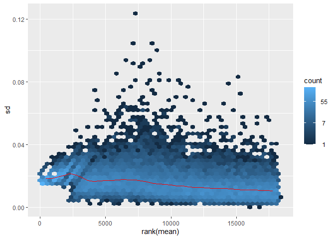

Differential Expression Analysis of RNAseq Data
================
Michal Varga
2024-10-31

# Introduction

This project presents a comprehensive differential expression analysis
of RNA-seq data, a powerful approach for uncovering gene expression
changes across different biological conditions. Using DESeq2, this
analysis identifies genes with significant expression differences,
shedding light on underlying biological processes, disease mechanisms,
and treatment effects. By leveraging RNA-seq technology, we gain
high-resolution insights into gene activity, enabling robust statistical
testing and meaningful interpretation of complex biological datasets.

## Load Required Libraries and Scripts

0.  (Optional) Install scientific packages via `BiocManager`.

``` r
if (!require("BiocManager", quietly = TRUE))
    install.packages("BiocManager")

BiocManager::install("DESeq2")
BiocManager::install("org.Bt.eg.db")
BiocManager::install("vsn")
```

1.  Load `BiocManager` related libraries.

``` r
library(DESeq2)
library(org.Bt.eg.db)
library(vsn)
```

2.  Load `CRAN` related libraries.

``` r
library(here)
library(RColorBrewer)
library(tidyverse)
library(pheatmap)
library(data.table)
```

3.  Load custom scripts and define colour palette.

``` r
here::i_am("README.md")
source(here("scripts/volcano_plot.R"))
pal <- brewer.pal(11,"RdBu")
```

## Load Count Data and Metadata

1.  Load count data and change the order of conditions.

``` r
data <- as.matrix(read.table('../Data/WT40vsMock.counts', header = T))
data <- data[,sort(colnames(data))] # reorder the conditions so they go control, condition
```

|  | Mock_16HR_1 | Mock_16HR_2 | Mock_16HR_3 | WT_40HR_1 | WT_40HR_2 | WT_40HR_3 |
|:---|---:|---:|---:|---:|---:|---:|
| ENSBTAG00000032047 | 124 | 139 | 88 | 44 | 91 | 94 |
| ENSBTAG00000003922 | 3210 | 3251 | 2613 | 1533 | 2765 | 2425 |
| ENSBTAG00000003923 | 344 | 282 | 210 | 288 | 617 | 501 |
| ENSBTAG00000032049 | 0 | 0 | 0 | 0 | 0 | 0 |
| ENSBTAG00000010652 | 2 | 7 | 3 | 3 | 8 | 7 |
| ENSBTAG00000003925 | 2053 | 1875 | 1533 | 898 | 1497 | 1368 |
| ENSBTAG00000000140 | 318 | 284 | 195 | 116 | 282 | 271 |
| ENSBTAG00000010653 | 1231 | 1136 | 868 | 484 | 796 | 852 |
| ENSBTAG00000000141 | 850 | 842 | 685 | 345 | 719 | 611 |
| ENSBTAG00000003927 | 3680 | 3580 | 2758 | 1680 | 3239 | 2826 |

2.  Load count metadata, arrange it as before, and remove `Names` column
    name.

``` r
data.meta <- as.data.frame(read.csv('../Data/WT40_meta.csv', header = T))

# reorder the conditions so they go control, condition
data.meta <- data.meta |> arrange(Names)

# removes the column name of sample names
data.meta <- data.meta %>% remove_rownames %>% column_to_rownames(var="Names")
```

|             | Condition |
|:------------|:----------|
| Mock_16HR_1 | untreated |
| Mock_16HR_2 | untreated |
| Mock_16HR_3 | untreated |
| WT_40HR_1   | treated   |
| WT_40HR_2   | treated   |
| WT_40HR_3   | treated   |

3.  Filters out viral transcripts (only leaves genes starting with ENS).

``` r
nrow(data)
```

    ## [1] 27617

``` r
data <- data[rownames(data) %like% "ENS", ]
nrow(data)
```

    ## [1] 27607

4.  Assess if count sample names and metadata sample names are equal.

``` r
all(rownames(data.meta) %in% colnames(data))
```

    ## [1] TRUE

## Create DESeq2 Object

1.  Create DESeq2 object.

``` r
dds <- DESeqDataSetFromMatrix(countData = data,
                              colData = data.meta,
                              design = ~ Condition)
```

    ## Warning in DESeqDataSet(se, design = design, ignoreRank): some variables in
    ## design formula are characters, converting to factors

2.  Set `untreated` condition as reference.

``` r
dds$Condition <- relevel(dds$Condition, ref = "untreated")
```

3.  Filter genes with no counts.

``` r
nrow(dds)
```

    ## [1] 27607

``` r
keep <- rowSums(counts(dds)) > 1
dds <- dds[keep,]
nrow(dds)
```

    ## [1] 18236

# Exploratory Analysis and Visualisation

## Data Transformation

Tools for analysis of multidimensional data require the same range of
variance at different ranges of the mean values (`homoskedasticity`).
Raw count data freom RNAseq expreriments, however, have variance that
grows with the mean. Transforming the dataset with transformations like
**Variance Stabilising Transformation** (VST) will lead in
`homoskedastic` data, by poroducing log2-like values high counts.

### Raw Count Data Skedasticity

``` r
meanSdPlot(log(assay(dds)[rowSums(assay(dds))>30,]))
```

    ## Warning: Removed 46 rows containing non-finite outside the scale range
    ## (`stat_binhex()`).

<!-- -->

### Variance Stabilising Transformation (VST) Processed Data Skedasticity

``` r
vsd <- DESeq2::vst(dds)
meanSdPlot(log(assay(vsd)[rowSums(assay(vsd))>0,]))
```

<!-- -->

## Principal Component Analysis (PCA)

``` r
DESeq2::plotPCA(vsd, intgroup = 'Condition')
```

    ## using ntop=500 top features by variance

<!-- -->

We see that 92% of the variance is due to the principal component (PC)
1, which seems to be the infection state.

## Sample Distances Plot

1.  Prepare Sample Distances Matrix

``` r
sampleDists <- dist(t(assay(vsd)))
sampleDistMatrix <- as.matrix(sampleDists)
colnames(sampleDistMatrix) <- NULL
```

2.  Plot it as heatmap.

``` r
colors <- colorRampPalette( rev(brewer.pal(9, "Blues")) )(255)
pheatmap(sampleDistMatrix,
         clustering_distance_rows = sampleDists,
         clustering_distance_cols = sampleDists,
         col = colors)
```

<!-- -->

We again observe the infected and uninfected samples being similar
within their conditions.

# Statistical Testing for Differences Attributable to Changes Between Conditions

1.  Create DESeq2 differential expression object.

``` r
dds <- DESeq2::DESeq(dds)
```

    ## estimating size factors

    ## estimating dispersions

    ## gene-wise dispersion estimates

    ## mean-dispersion relationship

    ## final dispersion estimates

    ## fitting model and testing

## Dispersion Estimation

In RNA-seq analysis, dispersion estimation is a critical step for
accurately modeling gene expression variability. DESeq2 assumes that
most genes are not differentially expressed, allowing it to estimate
dispersion (or variability) more precisely by pooling information across
genes.

Dispersion reflects the extent to which gene counts deviate from the
expected mean expression level across replicates. In DESeq2, this is
modeled using the Negative Binomial distribution, which accounts for
overdispersion commonly observed in RNA-seq data. Accurate dispersion
estimation enhances the detection of true differences in gene expression
between conditions by stabilizing variability in low-count genes,
reducing noise, and moderating extreme dispersion values.

The following plot shows gene-wise dispersion estimates against the mean
expression level. The black points represent per-gene estimates, while
the red line shows the fitted dispersion trend used by DESeq2 for
normalization.

``` r
DESeq2::plotDispEsts(dds)
```

<!-- -->

## Results Retrieval

Following [Schurch et al., (RNA,
2016)](https://rnajournal.cshlp.org/content/22/6/839.full.pdf)
recommendations, for 3 replicates per conditions we selected only genes
with a log fold change (LFC) of more than 0.5, and adjusted p-value
(alpha) of more than 0.01.

This way we have extracted the list of statistically significant,
differentialy expressed genes between the treated and untreated
conditions.

1.  Create results object with the thresholds mentioned above and order
    the genes based on ascending adjusted p-value.

``` r
resSchurch <- results(dds, lfcThreshold = 0.5, alpha = 0.01)
resSchurch <- resSchurch[order(resSchurch$padj),]
```

2.  Evaluate the obtained results.

``` r
head(resSchurch)
```

    ## log2 fold change (MLE): Condition treated vs untreated 
    ## Wald test p-value: Condition treated vs untreated 
    ## DataFrame with 6 rows and 6 columns
    ##                     baseMean log2FoldChange     lfcSE      stat      pvalue
    ##                    <numeric>      <numeric> <numeric> <numeric>   <numeric>
    ## ENSBTAG00000017363   2331.26        1.56882 0.0719097   21.8165 2.84963e-50
    ## ENSBTAG00000016169   2444.15        1.76847 0.0891588   19.8351 3.10972e-46
    ## ENSBTAG00000015591   5392.41        1.30885 0.0607338   21.5506 9.09871e-41
    ## ENSBTAG00000013303   8085.92        1.31222 0.0632513   20.7461 4.82161e-38
    ## ENSBTAG00000030425   1850.59        1.65658 0.0911274   18.1787 3.27899e-37
    ## ENSBTAG00000006599    329.68        2.17490 0.1334879   16.2929 2.05895e-36
    ##                           padj
    ##                      <numeric>
    ## ENSBTAG00000017363 4.59246e-46
    ## ENSBTAG00000016169 2.50581e-42
    ## ENSBTAG00000015591 4.88783e-37
    ## ENSBTAG00000013303 1.94263e-34
    ## ENSBTAG00000030425 1.05688e-33
    ## ENSBTAG00000006599 5.53034e-33

``` r
summary(resSchurch)
```

    ## 
    ## out of 18236 with nonzero total read count
    ## adjusted p-value < 0.01
    ## LFC > 0.50 (up)    : 168, 0.92%
    ## LFC < -0.50 (down) : 26, 0.14%
    ## outliers [1]       : 0, 0%
    ## low counts [2]     : 2120, 12%
    ## (mean count < 1)
    ## [1] see 'cooksCutoff' argument of ?results
    ## [2] see 'independentFiltering' argument of ?results

3.  Construct histogram of p-values to assess their distribution.

``` r
hist(resSchurch$pvalue,breaks=seq(0,1,.01))
```

<!-- -->

## Visual Assesment of Differentialy Expressed genes

Visualisations assess the assumption that the majority of genes are not
differentially expressed.

### Volcano plot

``` r
volcanoPlot(resSchurch)
```

    ## Loading required package: LSD

<!-- -->

### MA plot

``` r
DESeq2::plotMA(resSchurch, ylim = c(-5, 5))
```

<!-- -->

## Adding Gene Annotations

To obtain gene annotation data that in useful for possible downstream
gene enrichment analyses, we called `mapIds` function.

1.  Create a vector of ENSEMBL IDs from results object.

``` r
ens.str <- substr(rownames(resSchurch),1,18)
```

2.  Obtain gene symbol annotation.

``` r
resSchurch$symbol <- mapIds(org.Bt.eg.db,
                            keys=ens.str,
                            column="SYMBOL",
                            keytype="ENSEMBL",
                            multiVals="first")
```

3.  Obtain gene name annotation.

``` r
resSchurch$gene_name <- mapIds(org.Bt.eg.db,
                               keys=ens.str,
                               column="GENENAME",
                               keytype="ENSEMBL",
                               multiVals="first")
```

4.  Obtain gene ontology ID annotation.

``` r
resSchurch$go <- mapIds(org.Bt.eg.db,
                        keys=ens.str,
                        column="GO",
                        keytype="ENSEMBL",
                        multiVals="first")
```

5.  Obtain gene ontology type annotation.

``` r
resSchurch$ontology <- mapIds(org.Bt.eg.db,
                              keys=ens.str,
                              column="ONTOLOGY",
                              keytype="ENSEMBL",
                              multiVals="first")
```

|  | baseMean | log2FoldChange | lfcSE | stat | pvalue | padj | symbol | gene_name | go | ontology |
|:---|---:|---:|---:|---:|---:|---:|:---|:---|:---|:---|
| ENSBTAG00000017363 | 2331.260 | 1.568821 | 0.0719097 | 21.81652 | 0 | 0 | SAT1 | spermidine/spermine N1-acetyltransferase 1 | <GO:0005829> | CC |
| ENSBTAG00000016169 | 2444.148 | 1.768473 | 0.0891588 | 19.83509 | 0 | 0 | ID1 | inhibitor of DNA binding 1 | <GO:0000122> | BP |
| ENSBTAG00000015591 | 5392.414 | 1.308851 | 0.0607338 | 21.55062 | 0 | 0 | SQSTM1 | sequestosome 1 | <GO:0000423> | BP |
| ENSBTAG00000013303 | 8085.920 | 1.312220 | 0.0632513 | 20.74612 | 0 | 0 | ACSS2 | acyl-CoA synthetase short chain family member 2 | <GO:0003987> | MF |
| ENSBTAG00000030425 | 1850.587 | 1.656580 | 0.0911274 | 18.17872 | 0 | 0 | ID3 | inhibitor of DNA binding 3 | <GO:0000122> | BP |

## Heatmap of Top Variable Genes

``` r
topVarGenes <- head(order(rowVars(assay(vsd)), decreasing = TRUE), 15)

var_matrix  <- assay(vsd)[ topVarGenes, ]
var_matrix  <- var_matrix - rowMeans(var_matrix)

pheatmap(var_matrix)
```

<!-- -->
